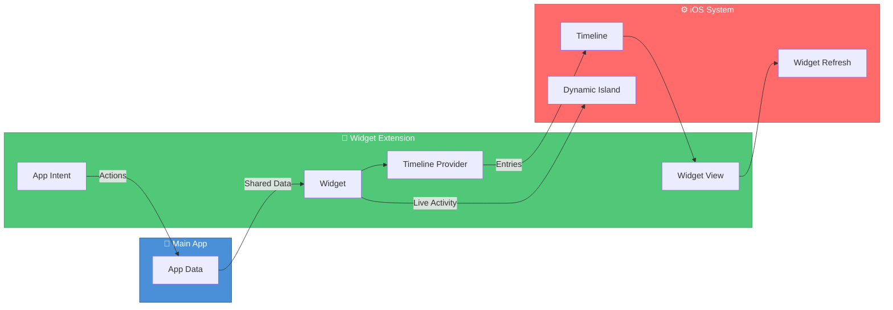

```
╔══════════════════════════════════════════════════════════════════════════════════════╗
║                                                                                      ║
║   ██╗    ██╗██╗██████╗  ██████╗ ███████╗████████╗    ██╗  ██╗██╗████████╗           ║
║   ██║    ██║██║██╔══██╗██╔════╝ ██╔════╝╚══██╔══╝    ██║ ██╔╝██║╚══██╔══╝           ║
║   ██║ █╗ ██║██║██║  ██║██║  ███╗█████╗     ██║       █████╔╝ ██║   ██║              ║
║   ██║███╗██║██║██║  ██║██║   ██║██╔══╝     ██║       ██╔═██╗ ██║   ██║              ║
║   ╚███╔███╔╝██║██████╔╝╚██████╔╝███████╗   ██║       ██║  ██╗██║   ██║              ║
║    ╚══╝╚══╝ ╚═╝╚═════╝  ╚═════╝ ╚══════╝   ╚═╝       ╚═╝  ╚═╝╚═╝   ╚═╝              ║
║                                                                                      ║
║   ████████████████████████████████████████████████████████████████████████████████   ║
║   █  iOS Widget Development Kit — Build stunning widgets in minutes, not days   █   ║
║   ████████████████████████████████████████████████████████████████████████████████   ║
║                                                                                      ║
╚══════════════════════════════════════════════════════════════════════════════════════╝
```

<div align="center">

**The complete toolkit for building beautiful iOS widgets with WidgetKit, Live Activities, and Dynamic Island.**

[](https://swift.org)
[](https://developer.apple.com/ios/)
[](https://developer.apple.com/widgets/)
[](https://swift.org/package-manager/)
[](LICENSE)
[](https://github.com/muhittincamdali/iOS-Widget-Development-Kit/actions)

[Features](#-features) • [Quick Start](#-quick-start) • [Live Activities](#-live-activities) • [Interactive Widgets](#-interactive-widgets-ios-17) • [Docs](Documentation/)

</div>

---

## ✨ Features

- 🏠 **Home Screen Widgets** — Small, medium, and large sizes with beautiful templates
- 🔒 **Lock Screen Widgets** — iOS 16+ circular and rectangular widgets
- ⚡ **Live Activities** — Real-time updates on lock screen and Dynamic Island
- 📺 **StandBy Mode** — iOS 17+ full-screen StandBy support
- 🖱️ **Interactive Widgets** — Buttons and toggles with App Intents (iOS 17+)
- ⏰ **Smart Timeline** — Efficient refresh management for battery optimization
- 🎨 **Pre-built Templates** — 20+ ready-to-use widget designs
- 📖 **Fully Documented** — Comprehensive guides and examples

---

## 🏗️ Architecture



---

## 🚀 Quick Start

### Installation

```swift
// Package.swift
dependencies: [
    .package(url: "https://github.com/muhittincamdali/iOS-Widget-Development-Kit.git", from: "1.0.0")
]
```

### Create Your First Widget

```swift
import WidgetKit
import SwiftUI
import iOSWidgetKit

struct MyWidget: Widget {
    let kind: String = "MyWidget"
    
    var body: some WidgetConfiguration {
        StaticConfiguration(kind: kind, provider: MyProvider()) { entry in
            MyWidgetView(entry: entry)
        }
        .configurationDisplayName("My Widget")
        .description("Shows important information.")
        .supportedFamilies([.systemSmall, .systemMedium, .systemLarge])
    }
}
```

### Timeline Provider

```swift
struct MyProvider: TimelineProvider {
    func placeholder(in context: Context) -> MyEntry {
        MyEntry(date: Date(), title: "Loading...")
    }
    
    func getSnapshot(in context: Context, completion: @escaping (MyEntry) -> Void) {
        completion(MyEntry(date: Date(), title: "Snapshot"))
    }
    
    func getTimeline(in context: Context, completion: @escaping (Timeline<MyEntry>) -> Void) {
        let entry = MyEntry(date: Date(), title: "Current Data")
        let timeline = Timeline(entries: [entry], policy: .after(Date().addingTimeInterval(3600)))
        completion(timeline)
    }
}
```

### Widget View

```swift
struct MyWidgetView: View {
    var entry: MyEntry
    
    var body: some View {
        VStack(alignment: .leading, spacing: 8) {
            Text(entry.title)
                .font(.headline)
            Text(entry.date, style: .time)
                .font(.caption)
                .foregroundStyle(.secondary)
        }
        .containerBackground(.fill.tertiary, for: .widget)
    }
}
```

---

## ⚡ Live Activities

```swift
import ActivityKit

// Define Activity Attributes
struct DeliveryAttributes: ActivityAttributes {
    public struct ContentState: Codable, Hashable {
        var status: String
        var estimatedTime: Date
    }
    var orderNumber: String
}

// Start Live Activity
func startDeliveryActivity(orderNumber: String) throws -> Activity<DeliveryAttributes> {
    let attributes = DeliveryAttributes(orderNumber: orderNumber)
    let state = DeliveryAttributes.ContentState(
        status: "Preparing",
        estimatedTime: Date().addingTimeInterval(1800)
    )
    return try Activity.request(
        attributes: attributes,
        content: .init(state: state, staleDate: nil)
    )
}

// Update Activity
func updateActivity(_ activity: Activity<DeliveryAttributes>, status: String) async {
    let state = DeliveryAttributes.ContentState(
        status: status,
        estimatedTime: Date().addingTimeInterval(900)
    )
    await activity.update(.init(state: state, staleDate: nil))
}
```

---

## 🖱️ Interactive Widgets (iOS 17+)

```swift
import AppIntents

struct RefreshIntent: AppIntent {
    static var title: LocalizedStringResource = "Refresh Widget"
    
    func perform() async throws -> some IntentResult {
        WidgetCenter.shared.reloadAllTimelines()
        return .result()
    }
}

struct InteractiveWidgetView: View {
    var body: some View {
        Button(intent: RefreshIntent()) {
            Label("Refresh", systemImage: "arrow.clockwise")
        }
        .buttonStyle(.bordered)
    }
}
```

---

## 🧩 Widget Types

| Type | iOS Version | Size | Description |
|:----:|:-----------:|:----:|-------------|
| 🏠 **Home Screen** | 14.0+ | S/M/L/XL | Standard home screen widgets |
| 🔒 **Lock Screen** | 16.0+ | Circular/Rect | Lock screen widgets |
| ⚡ **Live Activity** | 16.1+ | Dynamic | Real-time updates + Dynamic Island |
| 📺 **StandBy** | 17.0+ | Full Screen | StandBy mode widgets |
| 🖱️ **Interactive** | 17.0+ | All | Buttons and toggles |

---

## 📁 Project Structure

```
iOS-Widget-Development-Kit/
├── 📂 Sources/
│   ├── Core/              # Core widget utilities
│   ├── Widgets/           # Widget implementations
│   ├── LiveData/          # Live Activity support
│   ├── Integration/       # App integration helpers
│   ├── Analytics/         # Widget analytics
│   └── Performance/       # Performance optimization
├── 📂 Examples/           # Sample widget projects
├── 📂 Tests/              # Unit tests
└── 📂 Documentation/      # Guides
```

---

## 📋 Requirements

| Requirement | Version |
|-------------|---------|
| iOS | 16.0+ |
| Xcode | 15.0+ |
| Swift | 5.9+ |

---

## 📖 Documentation

| Guide | Description |
|-------|-------------|
| [Widget Design Guide](Documentation/WidgetDesign.md) | Design principles and best practices |
| [Timeline Management](Documentation/TimelineManagement.md) | Efficient refresh strategies |
| [Live Activities Guide](Documentation/LiveActivities.md) | Dynamic Island & Live Activities |
| [Best Practices](Documentation/BestPractices.md) | Performance and battery tips |

---

## 🤝 Contributing

Contributions are welcome! Please read our [Contributing Guide](CONTRIBUTING.md).

```bash
git checkout -b feature/amazing-widget
git commit -m "feat(widgets): add amazing widget"
git push origin feature/amazing-widget
```

---

## 📄 License

MIT License — see [LICENSE](LICENSE) for details.

---

<div align="center">

## 👨‍💻 Author

**Muhittin Camdali**

[](https://github.com/muhittincamdali)
[](https://linkedin.com/in/muhittincamdali)

---

**⭐ Star this repo if you find it useful!**

</div>
